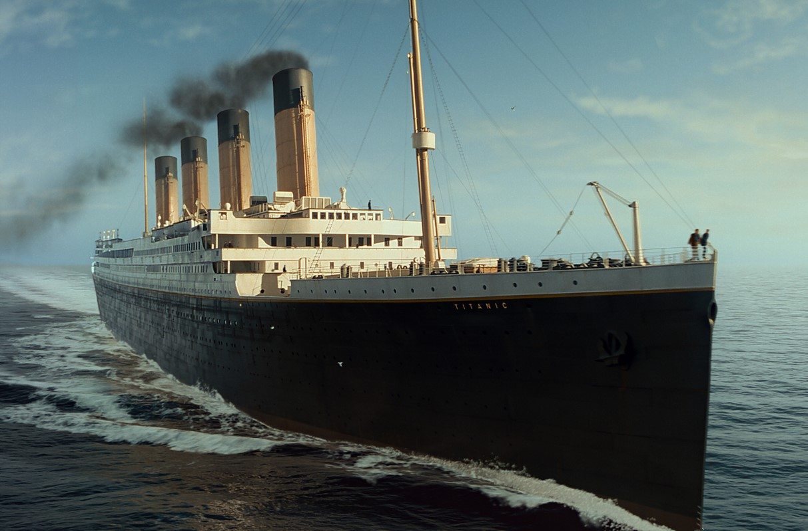
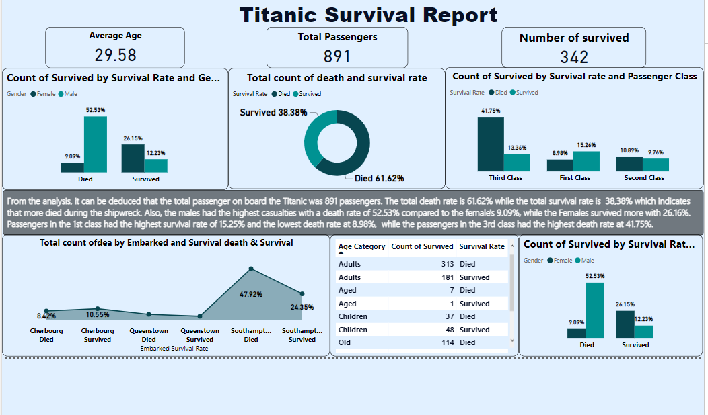
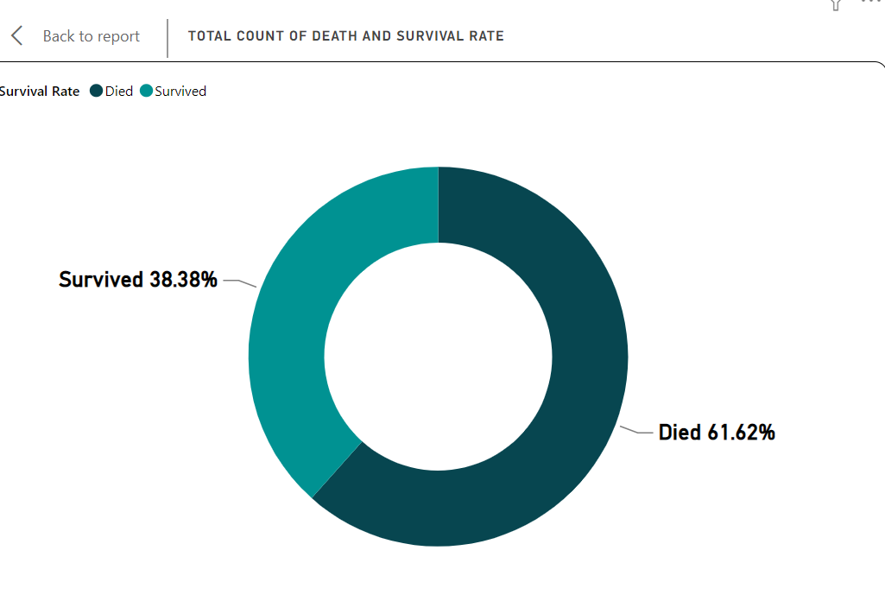
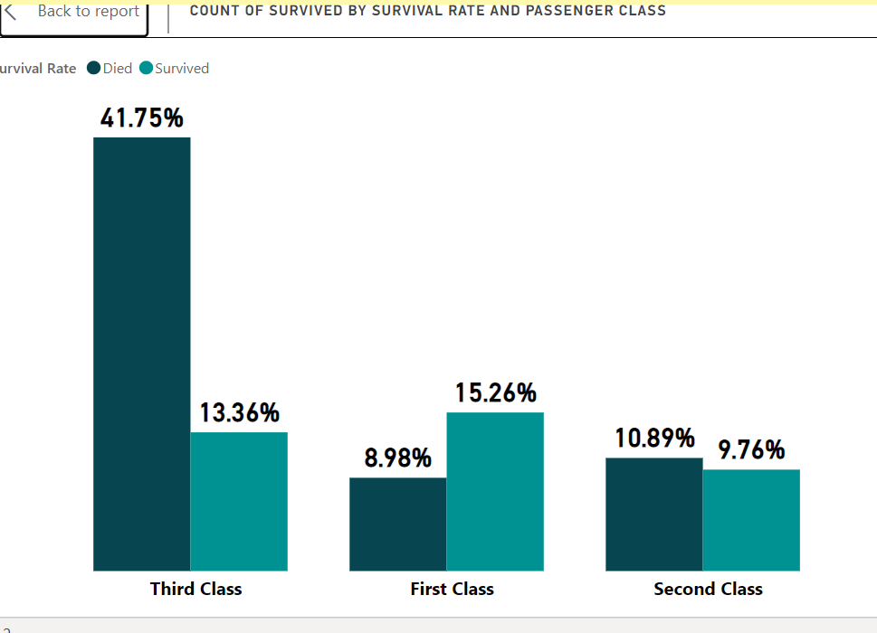
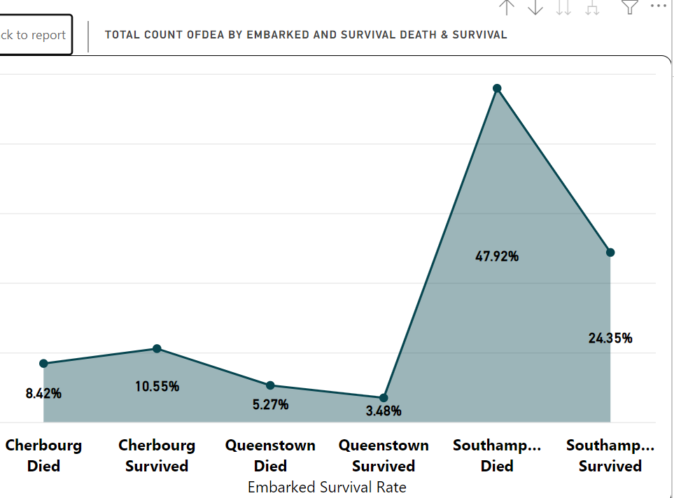
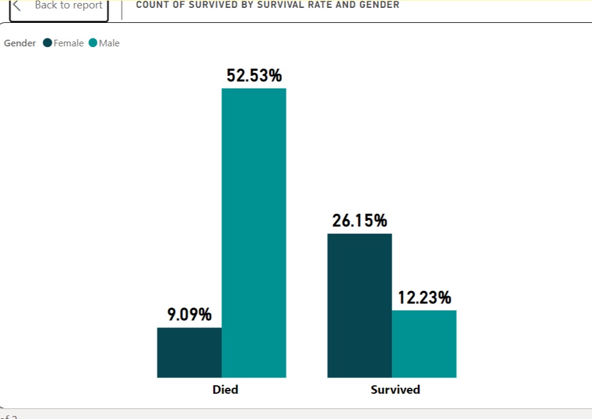
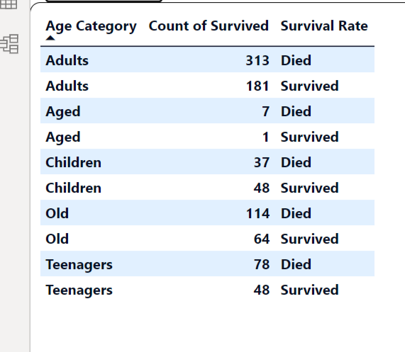

# Titanic-Survival-rAnalysis

## Introduction
***
This is a PowerBi analysis of the famous *Titanic ship* was a British passenger liner, operated by the White Star Line, which sank in the North Atlantic Ocean on 15 April 1912 after striking an iceberg during her maiden voyage from Southampton, England, to New York City, United States. Of the estimated 2,224 passengers and crew aboard, more than 1,500 died, making it the deadliest sinking of a single ship up to that time.The project is to analyze and create insight on the death and survival rate of the 891 passengers that were onboard te ship.
**Data Source**:Kaggle.com

## Problem statement
The objective of this project is to analyze and create insight on the death and survival rate of the 891 passengers that were onboard the ship.

- Total death and survival rate of passengers on the ship

- Total death and survival rate of each genders

- Total death and survival of each passengers class
 
- Total death and survival rate of embarkment of each  passenger.

## Dataset
***
The dataset contains 15 columns and 891 rows of informations of only passengers who boarded the titanic ship, Crew personnels were not included.
 The dataset is widely used in the data science community and was sourced from _** Kaggle.com_
 Features of the dataset includes:
- pasenger id
- sex
- Pclass
- survived
- Age
- Embarked
- Fare
- Cabin -sibsp — Number of Siblings/Spouses Aboard
- parch — Number of Parents/Children Aboard
- Name

 ## Data Cleaning
 ***
 After checking through the data, various cleaning was carried out on the each column using PowerBI query editor.
 
- The sex column name was changed to Gender and the first letters of each male and female was capitalized.

- The pclass column which was in figures 1,2 and 3 was transformed to first class, second class and third class using the  conditional column.

- The survied column was used create another column named **_Survival Rate**  using the conditional columnn to transform (0 to died and 1 to survived) .

- The Age column was used to create a new column **_Age Category** where a range of age group was created and named (children,teenagers, youths, Adults and aged).

- The Embarked column had letters C,Q and S which was changed to Cherbourg, Queenstown and Southampton.

- The names column was splitted to Last name, Titles and First name.

## Dashboard
Below is the Visualization of the Titanic which has insight derived from the dataset.

## Analysis
## Total Death and Survival Rate

***
The above chart depicts the survival and death rate of the Titanic dataset. 
From the chart we can see that 38.38% of the passengers survived while 61.62% of the passengers died. This indicates that majority of the passengers aboard the ship passed on during the shipwreck.

## Death and Survival rate by Passenger Class

**
From this chart, we can deduce that passengers in First class had a survival rate of 15.26% and a death rate of 8.98%, Passengers in second class had a survival rate of 9.76% and a death rate of 10.89% while pasengers in third class had survival rate of 13.36% and death rate 41.75%. Here we can conclude that the passengers in first class were rescued first which was what determined their high rate of survival rate while the passengers in third class didnt get swift rescue which is why they had the most casualties.
## Death and Survival rate by Embarkment

***
From the dataset, we understand that the passengers embarked on the ship from different locations, Queenstown, Southampton amd Cherbourg.
This chart shows that passengers from Southampton had a survival rate of 24.35% and death rate of 47.92%, Cherbourg a survival rate of 10.55% and a death rate of 8.42% , while Queenstown had a survival rate of 3.48% and a death rate of 5.27%. From this analysis we can deduce that southampton had the highest number of passengers who embarked from the town ,Cherbourg had the second highest passengers while Queenstown had the least passengers.

## Survied by Gender

***
This Shows that the death and and survival Male are is 52.53% and 12.23% respectively, while THe death and survival rate for Female are 9.09% and 26.15% respectively. From this analysis we can conclude that the male gender had the highest casualties while the Female gender survived the most. It can also be deduced that the majority of the the passengers on the ship were male.

## Age Category

***
Here we determined the death and survival rate by each age category aboard the ship. The table above shows us that 48 children died while 37 survived, 78 Teenagers died and 48 survived,313 Adults died and 181 survived,114 old died and 64 survived, 7 Aged died and 1 Survived.

## Conclusion
***
This analysis revealed that the Gender, passenger class, Embarked, Age columns were factors used to determine the death and survival rate of passengers on the Titanic. It gave insights as to how the rescuers prioritized passengers to be saved especially in regard to their class, age and Gender.
However, further analysis can be made on this dataset as helpful insights that can be garnered from it are limitless.

